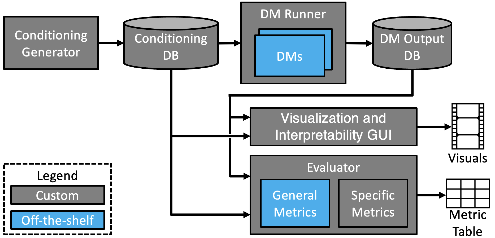
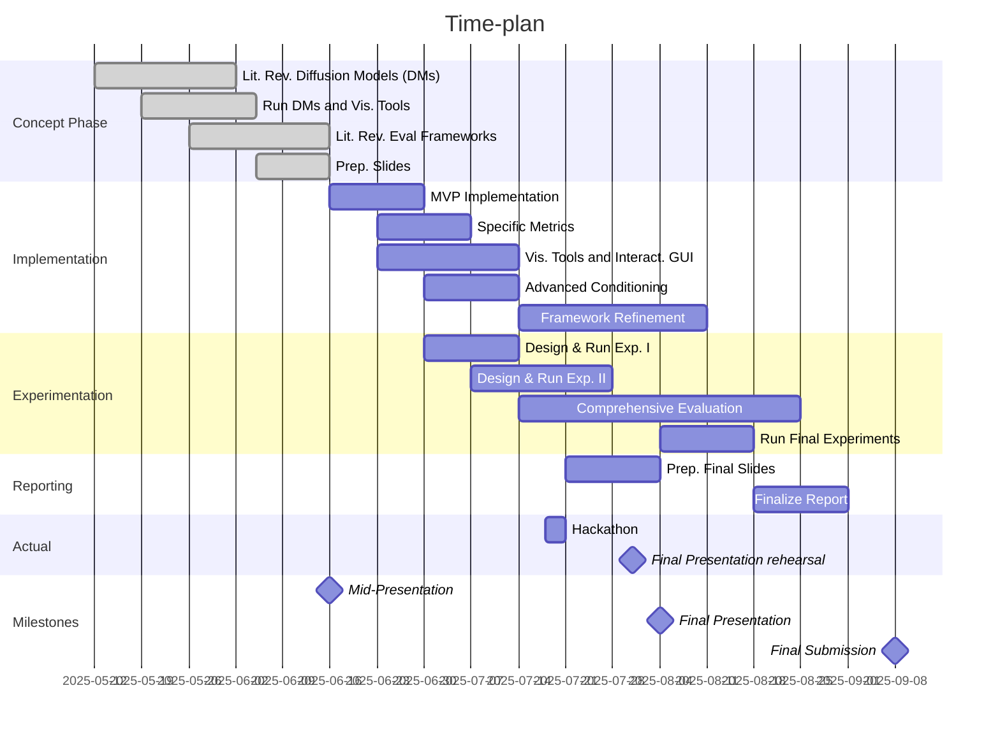

# TUM MLMI - DMCAF



## Local Setup
We recommend [conda](https://docs.conda.io/en/latest/) for setting up the python environment

### Prefered - Setup Based on eniroment.yml ()
```
conda env create -f environment.yml
```

### Alternative - Manual Setup
```
conda install pytorch torchvision torchaudio pytorch-cuda=12.8 -c pytorch -c nvidia
pip install --upgrade diffusers[torch] transformers matplotlib pyyaml pandas pytz ultralytics
```

## Run on Cluste:

Initial setup of the cluster is descibed in [this readme](https://gitlab.lrz.de/camp_cluster/documentation/-/blob/main/README.md#setup-user-profile)
To run dmcaf on the cluter create a job on the [WebPortal](https://master.garching.cluster.campar.in.tum.de/).
This can be done under "Submit Job" > "Single Job". Make sure:
- Project folder is mounted
- SSH is enabled if needed
- Correct docker iamge is chosen (ubuntu_22.04-python_3.10-cuda_12.1-pytorch_2.2.2-gpu)
Add the following as command with one of the options provided.

```bash
# Setup
pip install torch torchvision torchaudio --index-url https://download.pytorch.org/whl/cu124
pip install --upgrade diffusers[torch] transformers matplotlib pyyaml pandas pytz ultralytics six
export HF_HOME="/mnt/projects/mlmi/dmcaf/models/hf_home"
export TORCH_HOME="/mnt/projects/mlmi/dmcaf/models/torch_home"

# Option 1: Run a experiement, e.g.:
python /mnt/projects/mlmi/dmcaf/DMCAF/run_experiment.py /mnt/projects/mlmi/dmcaf/DMCAF/config/experiments/experiment_000.yaml

# Option 2: keep job running to allow for interative usage via SSH
sleep infinite
```

## Time Planing


## Tasks before Hackathon
- [ ] Familiarize with diffusors lib. + Define interfaces for Framework (Mock functions) - Marco
- [ ] Make DM runner work (start with one config) - Meric
- [ ] Metrics research e.g. FID Which pertained models exists which datasets are used for - Burak
- [ ] What exists specifically about medical images, (e.g. vector to location generation, domain shift) - Umut
- [ ] Download checkpoints - Rayan


- [ ] Make DMRUnner support other DMs (especially controlnet)
- [ ] Evaluation, add object count metric, other of the shelf metrics
- [ ] Segmentation mask condition generator for controlnet
- [ ] Visualization tool
