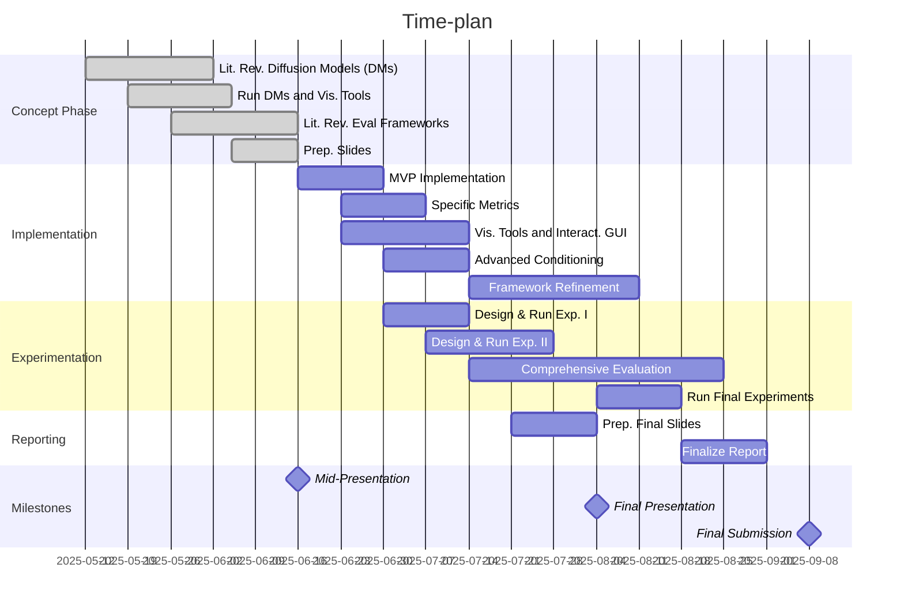

# TUM MLMI - DMCAF


## Setup
To setup your environment to run DMCAF run:
```
source setup.sh
```
As environment variables are used to define output and model cashing paths, its required to source `setup.sh` in every
If your want to use different paths, we recommend to create a `custom_setup.sh` file and source this.

## Usage
Create condition sets first:
```
python run_condition_gen.py config/condition_sets/condition_set_000.yaml
```

Run an experiment that references one or more condition sets:
```
python run_experiment.py config/experiments/experiment_000.yaml
```

## Time Planing


## Tasks
- [ ] Make DMRUnner support other DMs (especially controlnet)
- [ ] Evaluation, add object count metric, other of the shelf metrics
- [ ] Segmentation mask condition generator for controlnet
- [ ] Visualization tool
- [ ] Evaluation: implement sores IS, CLIP
- [ ] More Parameters for DM runner (We have: guidance scale, inference steps, add: Scheduler, Seed, Number of images, Image Dimensions, Negative Prompt (ad to condition generator vs. fixed set e.g. blurry, unrealistic))

FILE STRUCTURE:
    - DMCAF/
        - assets/
        - config/
        - dmcaf/
        - medical_image/
    - models/
    - data/ (OUTPUT_DIRECTORY)