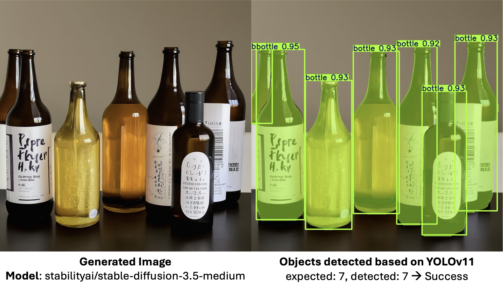
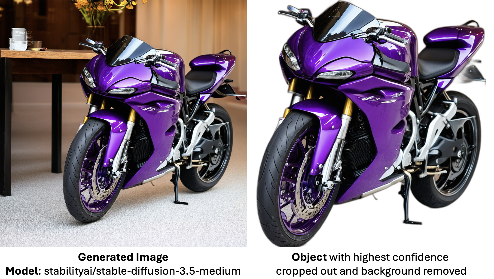

# DMCAF: Diffusion Model Conditioning and Analytical Framework

DMCAF is a modular framework that integrates multiple diffusion models, conditioning strategies, and evaluation pipelines.
It was developed as part of the **Machine Learning in Medical Imaging (MLMI)** Course at Technical University of Munich (TUM).

This project provides a modular pipeline for running and evaluating diffusion models:
 1. **Conditioning Generator** – Produces conditioning inputs (e.g., text prompts, segmentation maps) and stores them in a Conditioning Database.
 2. **Diffusion Model Runner (DM Runner)** – Loads one or more diffusion models, generates images from the conditioning inputs, and logs results into a DM Output Database.
 3. **Visualization & Interpretability** – Offers an interface to configure experiments, run the pipeline, and inspect results.
 4. **Evaluator** – Computes general and task-specific metrics using pre-trained models and off-the-shelf networks, saving results in a Metrics Database.


## Setup
We recommend working in a virtual environment for a cleaner workingspace.
To setup your environment to run DMCAF run:
```
source setup.sh
```
As environment variables are used to define output and model cashing paths.
If your want to use different paths, we recommend to create a `custom_setup.sh` file and source this.

If you are on Windows, try using powershell and running the installation commands manually:

```
pip install torch==2.6.0 torchvision==0.21.0 torchaudio==2.6.0 --index-url https://download.pytorch.org/whl/cu124
pip install -r requirements.txt
```
And then set the environment variables with the command below
```
$env:HF_HOME = "/mnt/projects/mlmi/dmcaf/models/hf_home"
$env:TORCH_HOME = "/mnt/projects/mlmi/dmcaf/models/torch_home"
$env:MONAI_HOME = "/mnt/projects/mlmi/dmcaf/models/monai_home"
$env:YOLO_CONFIG_DIR = "/mnt/projects/mlmi/dmcaf/models/yolo_config"
$env:OUTPUT_DIRECTORY = "/mnt/projects/mlmi/dmcaf/data"
```

## Usage
Create condition sets first:
```
python run_condition_gen.py config/condition_sets/condition_set_color.yaml
python run_condition_gen.py config/condition_sets/condition_set_count.yaml
python run_condition_gen.py config/condition_sets/condition_set_laparoscopic.yaml
```

Run an experiment that references one or more condition sets:
```
python run_experiment.py config/experiments/experiment_check_all.yaml
```
Run analysis after running count experiments:
```
python run_analysis.py --count --experiment-id <Experiment ID>
```
or color experiments:
```
python run_analysis.py --color --experiment-id <Experiment ID>
```

## Examples

### Count Adherance
Fot the count adherence experiments, the **count_prompts** option of the **condition_generator** generated promt of the following structure: `"a photo of <N> <object>"` 
For example the prompt `a photo of 7 bottles` results in the generated image below. The **YOLO Count** evaluator counts the number of these objects and compares the expected and detected nuber to asses how well the generation adherec to the conditioning.



### Color Adherance
For the color adherence experiments, the **color_prompts** option of the **condition_generator** produced prompts of the following structure: `a <color> <object> in front of the <background>`

For example the prompt `a purple motorcycle in front of the table` results in the generated image shown below. The **Color Classification** evaluator works as follows:  

1. **YOLO** detects bounding boxes and selects the object with the highest confidence score.  
2. The detected object is cropped and the background is removed.  
3. **CLIP** evaluates the isolated object image against a set of text prompts with different colors.  
4. If the highest CLIP score corresponds to the expected color, the generation is marked as a success; otherwise, it is marked as a failure.  

  

### Laparoscopic image generation

### FILE STRUCTURE:
    - DMCAF/
        - assets/
        - config/
        - dmcaf/
        - medical_image/ ##Training scripts for Fundus images
    - models/
    - data/ (OUTPUT_DIRECTORY)
        - experiment_xxx/  ## Generated images
        - analysis/  ## Plots and Results
        - conditioning.db ## SQLite DB storing the type and content of conditioning used
        - dm_output.db ## SQLite DB storing the paths and generation details of images
        - metrics.db ## SQLite DB storing the evaluation details of images
    - yolo_outputs/count/ ## YOLO segmentations of images for counting target objects
